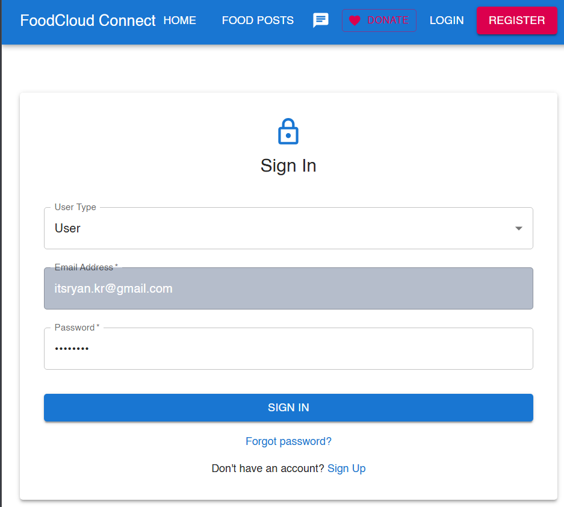
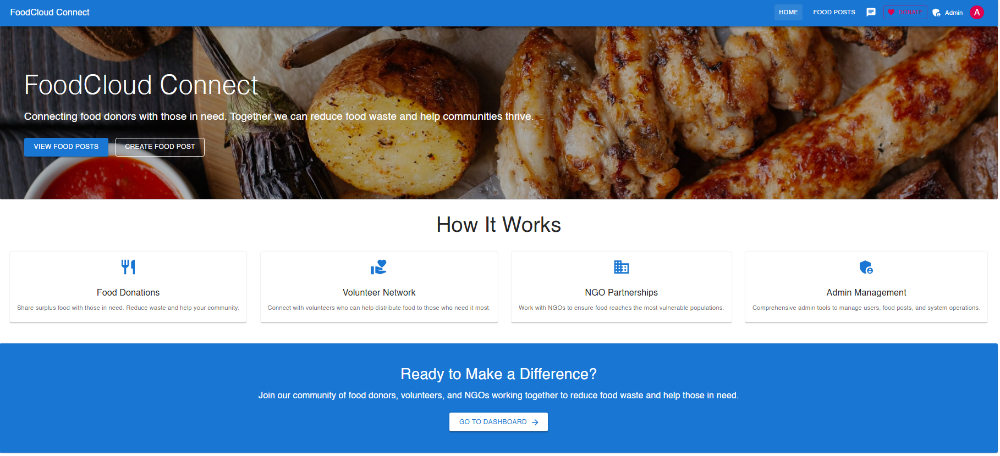
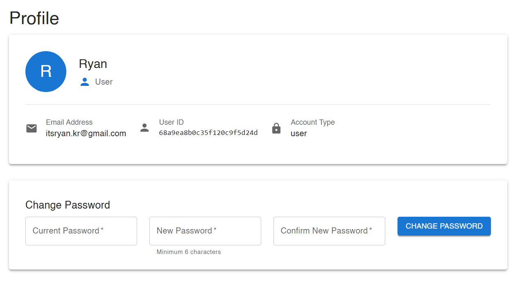
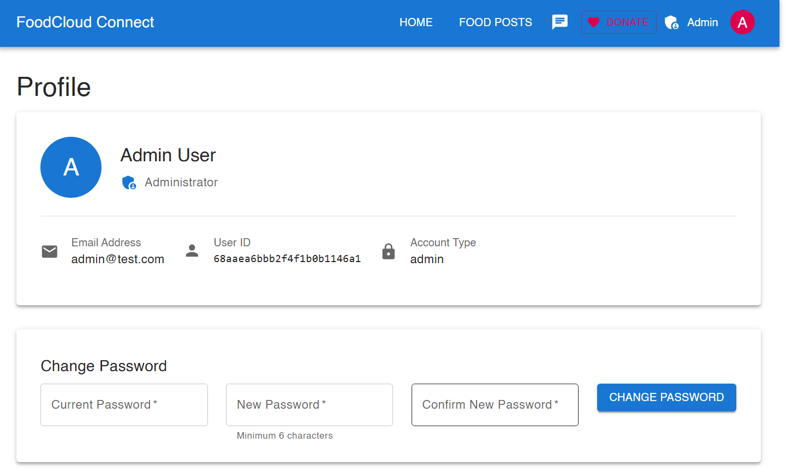
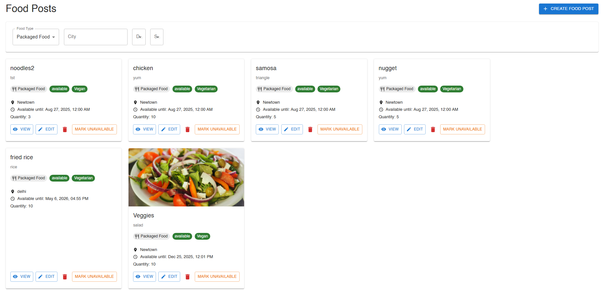

# 🥗 FoodCloud: Cloud-Based NGO & Waste Food Management System

A cloud-powered MERN stack web application designed to help NGOs manage and redistribute surplus food from donors (restaurants, events, households) to the underprivileged. It bridges the gap between food donors and volunteers using real-time tracking, secure authentication, and optimized delivery logistics.

---

## 🚀 Key Features

- 🔐 **User Management**: Role-based login (NGO, Donor, Volunteer, Admin)
- 📦 **Donation Management**: Real-time food request form with image and location and availability tagging
- 🗺️ **Admin Management**: Comprehensive admin tools to manage users, food posts and system operations
- 🗺️ **Pickup & Delivery**: Route optimization for volunteers
- 📊 **Analytics Dashboard**: Track total donations, meals served, and more
- 🛡️ **Security**: JWT authentication, bcrypt hashing, HTTPS
  
**Project Overview Diagram**


---

## 📸 Screenshots

### 🔐 Login Screen


### 🏠 Home Page


### 🧑 Donor Dashboard


### 🧑‍💻 Admin Dashboard


### 🥗 Food Posts


---

## 🧰 Tech Stack

### 🌐 Frontend
- React.js (Vite)
- HTML5, CSS3, Bootstrap 5
- Axios

### ⚙️ Backend
- Node.js + Express.js
- JWT Authentication
- Cloudinary for image uploads
- RESTful APIs

### 🗄️ Database
- MongoDB Atlas (Cloud)
- Mongoose ODM

### ☁️ Cloud & Hosting
- Render / Docker (Backend deployment)
- Vercel / Netlify (Frontend deployment)

### ✅ Testing
- Jest, Mocha
- Postman for API testing

---

## 📂 Project Structure

```bash
├── Client/
│   └── frontend/                   # React Frontend
│       ├── public/
│       │   └── vite.svg
│       └── src/
│           ├── assets/
│           ├── components/
│           │   ├── auth/          # Authentication components
│           │   ├── Chat/          # Real-time chat feature
│           │   │   ├── Controls/
│           │   │   └── Loader/
│           │   ├── food/          # Food post management
│           │   ├── ngo/           # NGO specific components
│           │   └── volunteer/     # Volunteer components
│           ├── contexts/          # React Context providers
│           └── services/          # API services
├── Server/                        # Node.js Backend
│   ├── config/                   # Configuration files
│   ├── controllers/              # Request handlers
│   ├── middleware/               # Custom middleware
│   ├── models/                   # Database models
│   ├── routes/                   # API routes
│   └── services/                 # Business logic
└── images/                       # Project screenshots
```

## 📦 Prerequisites

- Node.js
- MongoDB Atlas
- Postman for testing APIs

## 🛠️ Installation

```bash
# 1. Clone the repository
git clone https://github.com/username/Food-Cloud.git

# 2. Navigate into the project folder
cd foodcloud

# 3. Install backend dependencies
cd server
npm install

# 4. Install frontend dependencies
cd client
cd frontend
npm install

# 5. Build frontend (optional for deployment)
npm run build
```
## 🧪 Usage (Dev Mode)

```bash
# Run the backend server
cd server
npm start

# Run the frontend app
cd client
cd frontend
npm run dev

Then open http://localhost:5173 in your browser.
```
## 🧾 Agile Milestones (6 Weeks)

| Week | Sprint Goal                                |
| ---- | ------------------------------------------ |
| 1️⃣  | Planning, Environment Setup, Schema Design |
| 2️⃣  | User Authentication, Role Management       |
| 3️⃣  | Food Posting & Request Module              |
| 4️⃣  | Volunteer Assignment & Status Lifecycle    |
| 5️⃣  | Admin Dashboard, Cloud Deployment          |
| 6️⃣  | Testing, UI Polishing, Documentation       |

## 📈 Future Enhancements

- 🔔 Push Notifications via Firebase
- 🌐 Multi-language support
- 📱 SMS reminders for pickups
- 📦 QR code-based delivery verification

## 🤝 Contributors
- Rupayan Kumar
- Subhajit Sadhukhan
- Rishab Das
- Saptarshi Dutta

## 📃 License
This project is licensed under the MIT License.
